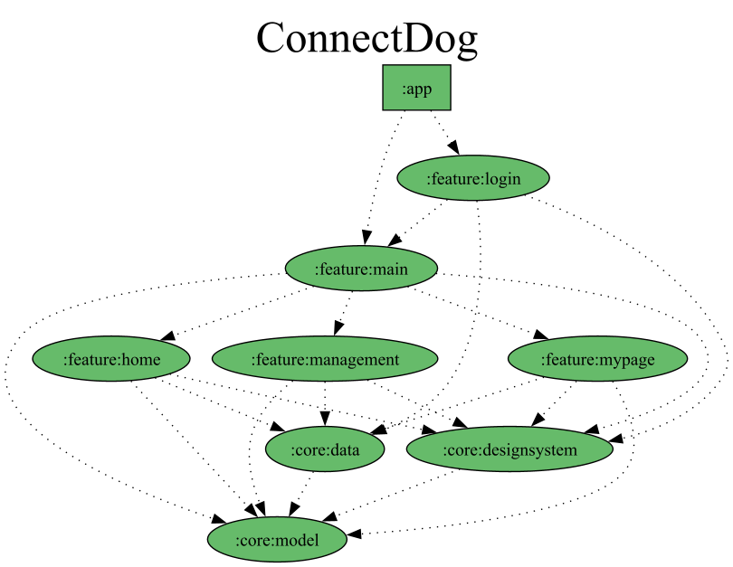

# PawWithU-AOS

## 🖥 Development

### Required

- IDE : Android Studio Giraffe ([Download](https://developer.android.com/studio))
- JDK : Java 17 (jbr-17 사용)
- Kotlin Language : 1.8.2

### Language

- Kotlin

### Libraries

- AndroidX
  - Activity & Activity Compose
  - AppCompat
  - Core
  - Lifecycle & ViewModel Compose
  - Navigation

- Kotlin Libraries (Coroutine, DateTime, Serialization)
- Compose
  - Material3
  - Navigation

- Landscapist & Landscapist Coil
- Dagger & Hilt
- Square (Retrofit2, OkHttp3)

#### Gradle Dependency

[Gradle Version Catalog](https://docs.gradle.org/current/userguide/platforms.html) 를 활용하여 종속성과 플러그인을 관리하고 있습니다.

자세한 내용은 [libs.versions.toml](https://github.com/PawWithU/ConnectDog-AOS/blob/main/gradle/libs.versions.toml) 를 참고해 주세요.

## 🧩 Architecture
### Module Dependency Graph
본 프로젝트는 Multi-module 구조이며 각 Feature마다 모듈 형태로 구성되어 있습니다.

  

## 🤝 협업 규칙
### Coding Convention & Tool

- [Ktlint](https://pinterest.github.io/ktlint/1.0.0/)
- [Kotlin coding convention](https://kotlinlang.org/docs/coding-conventions.html)
- [Android Kotlin Style Guide](https://developer.android.com/kotlin/style-guide?hl=ko)

### Commit Convention

|    Type    | Description                 |
|:----------:|-----------------------------|
|   `feat`   | 신규 기능 구현 작업 (UI 구현 포함) |
|  `style`   | 이미지, 폰트 등 values에 추가할 때 |
| `update`   | 파일 코드 수정, 리팩토링 작업      |
| `delete`   | 파일 삭제                      |
|   `docs`   | 문서 관련 작업                  |
|   `fix`    | 버그 수정                      |
|  `rename`  | 변수/클래스/메서드 명 변경         |
|  `build`   | dependencies 변경             |
|  `chore`   | configs 변화 등 그 외 작업 (코드 변경 X) |

### Branch Strategy 
#### 작업 순서
1. 기능 개발 전 `Issue` 생성
2. Issue 페이지에서 `새 branch` 생성
3. local에서 작업 후 해당 branch로 `PR` 올리기
4. PR에 대한 리뷰로 모두에게 approve 되면
5. PR 올린 당사자가 `develop`에 merge
   - 필요없을 시 해당 branch 삭제 
   - **PR은 항상 `FIFO` 순서대로 merge**

#### Git flow
  - `main` : 출시 준비 완료된 branch
  - `develop` : 다음 출시 버전을 개발하는 branch
  - `feature/**` : 기능 개발을 위한 branch
    - 예시: feature/member-api
  - `release` : 출시 전 QA를 위한 branch
  - `hotfix/**` : 출시된 버전의 버그를 수정하는 branch
    - 예시: hotfix/login
  
